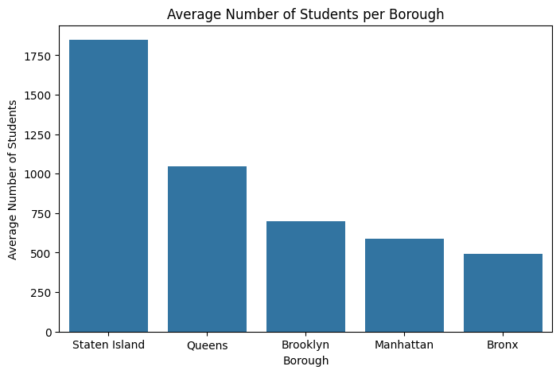
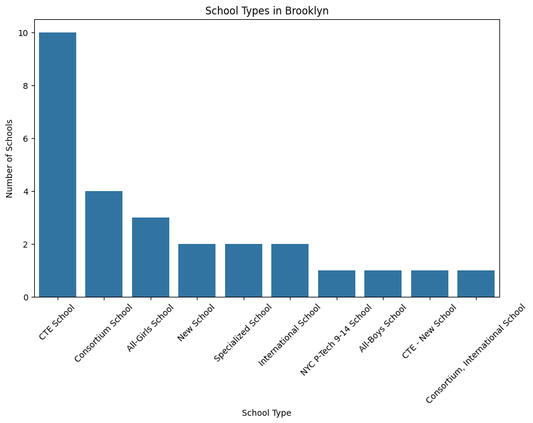

# 🐍 Python Data Exploration
 With Python and Pandas, focusing on basic data cleaning, grouping, filtering, and visualization using a real-world dataset.

---

## 🧠 Task Summary

Using a Jupyter Notebook to explore the **NYC High School Directory** dataset. Your goals today:

- Load and preview the dataset
- Clean column names
- Perform basic filtering and group-based summaries
- Create a few simple visualizations
- Share insights based on your findings

## Task Finding and Visualization

---
#### Skill Learning:
- Exploring the data is important to understand the data structure and basic information.
- This dataset has no missing values and no duplicate rows.
- groupby is very useful for checking counts and averages by specific fields.
- Visualization helps to clearly highlight key points.
- Installing packages in the local programming environment requires using !pip install.
#### Key Findings:
- Brooklyn has the highest number of schools compared to other boroughs, but the average number of students per school is the lowest.
- CTE schools are the most common school type in Brooklyn, while Specialized Schools are the least common.
- Brooklyn offers the most language classes with 26 unique languages, whereas Staten Island offers the fewest language classes (10), covering only 8 unique languages.

#### Visualization

